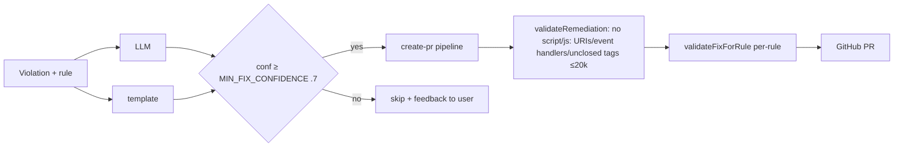

# Volume 3 — AI Engine (Remediation)

## 1. Endpoint & gate

- `POST /api/remediate` (+ `/remediate/batch`) — permission `GENERATE_REMEDIATION`,
  rate limit 20/min, verified-email write gate.
- Input: violation IDs (optionally `forceRegenerate`); output cached on the `Violation` row
  (`remediationCode`, `aiExplanation`, `aiConfidenceScore`).

## 2. LLM integration (verified)

`src/app/api/remediate/remediation.ts` — no SDK; raw OpenAI-style `fetch` to:

| Env | Default |
| --- | --- |
| `AI_BASE_URL` | `https://integrate.api.nvidia.com/v1` (NVIDIA NIM) |
| `AI_MODEL` | `meta/llama-3.3-70b-instruct` |
| `AI_API_KEY` | (required for LLM mode) |

- System prompt: WCAG consultant persona with rule context; `temperature 0.2`,
  `max_tokens 1000`.
- Structured parse of markers: `---CODE---`, `---EXPLANATION---`, `---CONFIDENCE---`.
- **Template fallback**: `templateRemediation()` — rule-based snippets (image-alt, label
  synthesis, link-name, color-contrast) with confidence `0.5`; used whenever no key or API error.
  → AI is additive, never blocks scans.

## 3. Confidence & validation chain

- `MIN_FIX_CONFIDENCE = 0.7` (github/create-pr) — low-confidence fixes skipped with feedback.
- `validateRemediation` (`src/lib/github-pr.ts`) blocks injection vectors; `validateFixForRule`
  (`src/lib/fix-validation.ts`) enforces per-rule sanity.

## 4. Model routing & cost — GAPS (explicit)

- **No routing logic** (single model), no provider fallback beyond template.
- **No token/cost accounting**; no per-org budgets; no prompt library versioning.
- No eval set/regression on remediation quality.
- Canned confidence: scanner (`axe-core.ts`) persists `aiConfidenceScore: 0.92` + canned text
  without invoking LLM → DB shows "AI" fixes in no-LLM env. **This is a known inconsistency
  to fix in V6 (AI honesty).**
- Demo `.env` has no `AI_API_KEY` → everything template mode (confidence 0.5) → GitHub PR gate
  may skip.

## 5. Roadmap (Volumes 5/11)
- Multi-model routing (cheap first, fallback up), per-org budget + `stats/usage` wire-up,
  prompt library, quality eval harness, cost per fix KPI.