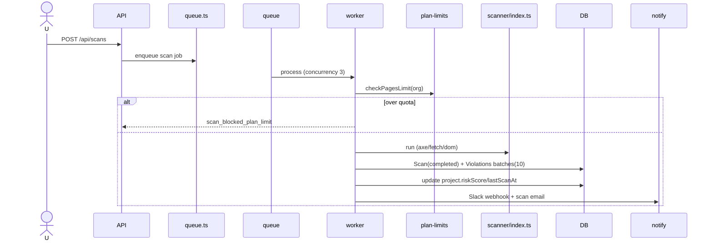

# Volume 3 — Backend Architecture

## 1. Layers

```
browser / operators
  → Next.js route handlers (src/app/api/**)
    → guard chain: src/lib/rbac.ts (requireAuth → verification → permission → orgAccess)
    → domain lib (src/lib/*) & services (src/services/*)
    → Prisma (PostgreSQL), Redis (+BullMQ), Stripe/Resend/NVIDIA
```

No service bus; everything is a single Next.js process + worker-in-process (BullMQ).

## 2. Guard & permission chain (src/lib/rbac.ts)

- `getServerSession(authOptions)` first, then JWT fallback so bearer-API also works.
- `requireAuth` → 401; `requirePermission(perm)` → checks `resolvePermissions(userId)`
  (owner=all, admin=all-minus-billing, member=customRole merged) and enforces
  `VERIFICATION_REQUIRED` on POST/PATCH/PUT/DELETE.
- `requireRole(['admin','owner'])` for admin surfaces.
- `requireOrgAccess`/`requireProject`/`requireScan` prevent cross-tenant. Unit-tested
  (RBAC + tenant-isolation vitest).

## 3. Domain libs (src/lib)

| Module | Responsibility |
| --- | --- |
| `auth.ts` (200 L) | NextAuth options: credentials (bcrypt 12), OAuth provisioning (default org), MFA `MFA_REQUIRED`, JWT/session claims (id, role, orgId, orgSlug, emailVerified), signToken/verifyToken 7d |
| `rbac.ts` (223 L) | Entire auth/authorization core (above) |
| `db.ts` | Prisma singleton (logging dev, silent prod) |
| `redis.ts` | Redis client (BullMQ + cache) |
| `queue.ts` | BullMQ scans queue: quotas, scan, batch insert (×10), riskScore formula, Slack+email notify |
| `scheduler-daemon.ts` | Rolling 60s tick claims due ScheduledScan/Project.nextScheduledScan→enqueue; custom DRF scheduler (no cron lib) |
| `cron.ts` | 5-field cron parser + `getNextRun` |
| `plan-limits.ts` | Monthly page quota check against plan |
| `rate-limit.ts` | Redis rate limiter w/ in-memory failover; presets (global 100/m, scan 10/m, remediate 20/m, projects 30/m) |
| `crypto.ts` | AES-GCM encrypt/decrypt (GitHub tokens) |
| `github.ts` (308L) | Octokit OAuth + repo + branch + file patch + PR create/status + token revoke |
| `github-pr.ts` | Warrappers: branch naming `accessguard/fix-{rule}-{date}-{ts}`, fix-comment blocks, `validateRemediation` (block script injection, `javascript:`, event handlers, ≤20k chars) |
| `fix-validation.ts` | Per-rule fix sanity (`validateFixForRule`) |
| `email.ts` | Resend transactional templates (scan-complete, welcome, reset, verify, invite) + Slack webhook; demo-mode fallback |
| `stripe.ts` (≈) | createCustomer, createSubscription (`default_incomplete`), cancel, reactivate, webhook verify; `null` when unset |
| `error-logger.ts` | Structured error capture (Sentry optional `SENTRY_DSN`) |
| `flags.ts` | Feature flags (`FLAG_CACHE_TTL`) |
| `url-validation.ts` | URL/protocol sanitization |

## 4. Job execution (scans)



Failures: job attempts 3, backoff 2s, `removeOnComplete: 100`; `errorMessage` captured on Scan.
Instrumentation (`src/instrumentation.ts`) boots worker+scheduler in-process on `NEXT_RUNTIME=nodejs`; disabled in edge.

## 5. Failover & resilience
- Rate limiter falls back to in-memory when Redis unreachable.
- AI: template remediation fallback on LLM error/no key.
- Payments/email/GitHub: guarded `null`/demo paths when creds absent — UI degrades gracefully.
- DB backup script (`scripts/db-backup.mjs`, pg_dump) with prune.

## 6. Known backend gaps (explicit)
- No dedicated worker process/container (in-process only) → concurrency coupled to app instance.
- No OpenAPI route listing endpoint; spec lives in docs.
- `queue.ts` scanner writes `aiConfidenceScore: 0.92` canned — not the LLM value (see AI Engine).
- Schedule is custom ticker; no built-in cron lib (apt; deterministic one-offs).
- Audit log & bell read both `audit`/`audit-logs` — keep parity.
- No metrics exporter (stats/usage only). Observe health endpoint.