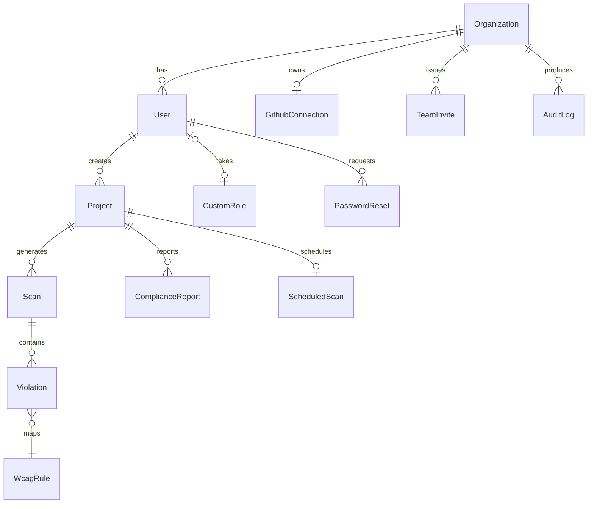

# Volume 3 — Database Design

> Source of truth: `prisma/schema.prisma` + `prisma/migrations/*` + `prisma/check-constraints.sql`. PostgreSQL 16.

## 1. ER model (13 tables)

(Full relation detail: every FK is `ON DELETE CASCADE` except `User.customRoleId → CustomRole SET NULL`.)

## 2. Tables & columns

### Organization
`id`, `name`, `slug @unique`, `plan` (Starter/Growth/Agency/Enterprise), `settings JSON`, `createdAt`, `updatedAt`.

### User
`id`, `email @unique`, `password` (bcrypt hash), `role` (owner|admin|member), `orgId → Organization CASCADE`,
`emailVerifiedAt`, `mfaEnabledAt`, `mfaSecret` (otplib), `customRoleId → CustomRole SET NULL`,
`emailVerificationTokenExpiresAt`. *(second migration adds expiry column + customRoleId.)*

### CustomRole
`id`, `orgId → Organization CASCADE`, `name`, `permissions JSON (string[])`, `@@unique([orgId, name])`.

### Project
`id`, `orgId → Organization`, `name`, `url`, `crawlConfig JSON` (default `{"maxPages":100,…}`),
`scanConfig JSON`, `verificationToken`, `isVerified`, `lastScanAt`, `riskScore`, `nextScheduledScan`,
`isActive`, `deletedAt` (soft-delete).

### Scan
`id`, `projectId → CASCADE`, `status` (pending|running|completed|failed|cancelled), `startedAt`, `completedAt`,
`pagesScanned`, `violationsFound`, `summary JSON`, `errorMessage`, `deletedAt`. Indexed on `createdAt`.

### Violation
`id`, `scanId → CASCADE`, `projectId`, `ruleId → WcagRule`, `wcagCriteria`, `severity`
(Critical|Serious|Moderate|Minor), `url`, `elementSelector`, `elementHtml`, `description`,
`remediationCode`, `aiExplanation`, `aiConfidenceScore float`, `status`, `githubPrUrl`, `fixedAt`,
`deletedAt`. Batch-inserted in chunks of 10.

### GithubConnection
`id`, `orgId`, `installationId @unique`, `repositories JSON`, `isActive`, (`accessToken`/`refreshToken`
stored encrypted via `src/lib/crypto.ts`).

### AuditLog
`id`, `orgId`, `action`, `metadata JSON`, `createdAt`. Indexed for timeline queries.

### PasswordReset
`id`, `email`, `token @unique` (hashed lookup), `expiresAt`, `used bool`. Indexed on `email`.
*(verify-reset-token does hash lookup — token never stored in the clear.)*

### TeamInvite
`id`, `orgId`, `email`, `role`, `token @unique` (**hashed at rest**), `invitedBy`, `acceptedAt`, `expiresAt`.

### ComplianceReport
`id`, `projectId → CASCADE`, `name`, `reportType`, `format`, `status`, `summary JSON`, `metadata JSON`,
`dateRange`, `fileUrl`, `generatedAt`, `expiresAt`, `deletedAt`. Indexed on `deletedAt`.

### ScheduledScan
`id`, `projectId @unique`, `frequency`, `cron` (5-field), `nextRunAt`, `lastRunAt`, `isActive`.
Unique `projectId` (one active schedule/project).

### WcagRule
`id`, `ruleId @unique`, `name`, `description`, `wcagCriteria`, `level` (A/AA/AAA), `category`, `howToFix`.
Seeded from `src/data/wcag-rules.ts`.

## 3. Indexes & constraints

- Unique: `User.email`, `Organization.slug`, `CustomRole.[orgId,name]`, `TeamInvite.token`, `PasswordReset.token`, `GithubConnection.installationId`, `ScheduledScan.projectId`.
- Non-cluster indexes added in migration 2: `User_orgId`, `Scan_createdAt`, `Violation_deletedAt`, `Project_deletedAt`, `ComplianceReport_deletedAt`, `PasswordReset_email`, `CustomRole_orgId`.
- CHECK constraints (non-migrated, applied via `npm run db:constraints` from `prisma/check-constraints.sql`): plan values, scan status, violation severity, riskScore ∈ [0,100].

## 4. Tenant isolation & soft-delete

- Every tenant-owned row is reachable from `orgId` (User/Project/Scan/Violation/…); API layer joins
  org membership before reads (`requireOrgAccess`, `requireProjectAccess`) — audited by `tenant-isolation` vitest.
- Soft-delete: `deletedAt` on Project, Scan, Violation, ComplianceReport → rows hidden but retain referential history.

## 5. Migration workflow

- `prisma migrate dev` for local; `prisma migrate deploy` at container boot (`docker-entrypoint.sh`).
- `npm run db:push:{dev|prod}` used for schema push during development rounds (documented in CI).
- 2 migrations: `0_baseline (12 tables) + `20260805_email_verification_expiry_and_indexes` (soft-delete cols, CustomRole, indexes).
- Backup: `scripts/db-backup.mjs` (pg_dump based) → `npm run db:backup`, prune; restore via `npm run db:restore`.

## 5. Data notes
- 13 models ≠ "100+ tables" user target: current prod schema is intentionally lean; this doc serves as seed for future normative additions (subscriptions? Invoicing? — see pricing design).
- Risk score formula (`queue.ts`): `clamp(100 − 10×crit − 5×serious − 2×moderate − 1×minor)`.