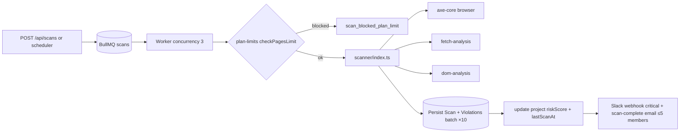

# Volume 3 — Scanner Architecture

## 1. What it does (real implementation)

AccessGuard scans **live customer websites** — no third-party a11y service. Orchestration:
`src/services/scanner/index.ts` picks one of three strategies per input mode, all produce
`{ violations, pagesScanned }`.

## 2. Strategies

| Strategy | File | Method | Best for |
| --- | --- | --- | --- |
| `axe-core` | `strategies/axe-core.ts` | Puppeteer headless Chromium loads URL, injects **axe-core 4.8.4** (cdnjs), runs with tags `wcag2a, wcag2aa, wcag21a, wcag21aa` | Full browser rendering (SPAs) |
| `fetch-analysis` | `strategies/fetch-analysis.ts` | Plain `fetch` (15s abort, 2MB cap, ≤5 redirects) + regex rule engine; crawls up to 20 same-host links (`maxPages` default 10) | Fast/static pages |
| `dom-analysis` | `strategies/dom-analysis.ts` | Regex analysis of already-fetched HTML | Pasted HTML / offline |

- Timeouts (axe): CDN load 10s, axe run 45s. Puppeteer flags `--no-sandbox`, `--disable-dev-shm-usage`.
- Optional screenshot (base64) on violations.
- HTTP 403/429 → worker falls back browser→server strategy (`scanUrlServer`).

## 3. Rule engine (fetch/dom regex pass)

Checks: `<title>` presence, `lang` attr, img `alt`, heading order, ARIA roles, meta viewport,
generic link text, input labels, plus a **contrast placeholder** (no pixel analysis — marked gap).
Rules map to `src/data/wcag-rules.ts` (seeded `WcagRule` table: ruleId, criteria, level, category, howToFix).

## 4. Execution pipeline

- `Scan` lifecycle: pending → running → completed|failed (errorMessage captured).
- Risk score: `clamp(100 − 10×critical − 5×serious − 2×moderate − 1×minor)`.
- Job settings: attempts 3, backoff 2s, `removeOnComplete 100`.

## 5. Scheduling

- `ScheduledScan` (unique per project): `frequency` + 5-field cron → `nextRunAt`.
- `src/lib/scheduler-daemon.ts`: BullMQ `scheduler` queue ticks every 60s, claims most-due
  project (incl. `Project.nextScheduledScan` one-offs) and enqueues real scan jobs.
- External trigger: `POST /api/schedule/process` (HP `X-Scheduler-Api-Key`) for hosted clocks.

## 6. Limits & safety

- Monthly **page quota** per plan (`plan-limits.ts`).
- Fetch caps (2MB, redirects 5, 15s), crawl cap (20 links, `maxPages` default 10; crawlConfig default 100).

## 7. Gaps & roadmap

- Contrast/color checks are heuristics, not pixel analysis (axe handles real ones in browser path).
- No Lighthouse integration; browser path is Puppeteer+axe only.
- `axe-core` strategy writes canned `aiConfidenceScore: 0.92` (not from LLM) — see AI Engine.
- No distributed worker pod (in-process); concurrency 3 fixed.
- No scan-fanout to per-page jobs yet; one job scans whole site.