# AccessGuard — Complete Project Report

> **Generated:** August 24, 2026 · **Version:** 1.0 · **Status:** Reference Document
> **Project:** AccessGuard — AI-Powered Web Accessibility Compliance Platform

---

## Table of Contents

1. [Executive Summary](#1-executive-summary)
2. [Project Timeline & History](#2-project-timeline--history)
3. [Architecture & Tech Stack](#3-architecture--tech-stack)
4. [Feature Inventory](#4-feature-inventory)
5. [API Reference](#5-api-reference)
6. [Security & Compliance](#6-security--compliance)
7. [Testing & Quality Assurance](#7-testing--quality-assurance)
8. [DevOps & Infrastructure](#8-devops--infrastructure)
9. [AI Capabilities](#9-ai-capabilities)
10. [Business & Market](#10-business--market)
11. [Internationalization (i18n)](#11-internationalization-i18n)
12. [Development Process & Tooling](#12-development-process--tooling)
13. [Database Design](#13-database-design)
14. [Known Gaps & Deferrals](#14-known-gaps--deferrals)
15. [Roadmap & Future Work](#15-roadmap--future-work)
- [Appendix A: Full Metrics Dashboard](#appendix-a-full-metrics-dashboard)
- [Appendix B: Package Dependencies](#appendix-b-package-dependencies)
- [Appendix C: Environment Variables](#appendix-c-environment-variables)
- [Appendix D: Glossary](#appendix-d-glossary)

---

## 1. Executive Summary

**AccessGuard** is a full-stack SaaS platform that continuously scans websites for accessibility violations (WCAG 2.1/2.2 AA), provides AI-powered remediation suggestions, and generates compliance reports — helping organizations avoid ADA lawsuits and meet global accessibility regulations including the European Accessibility Act (EAA), Section 508, and EN 301 549.

Built on **Next.js 16** with **React 19**, **Prisma 6** on **PostgreSQL**, **Redis** for caching/queuing, and a **Puppeteer + axe-core** scanner engine, AccessGuard combines automated scanning with AI-driven fixes via **NVIDIA NIM** (Llama 3.3 70B). The platform supports multi-tenant organizations with a full RBAC system, Stripe-integrated billing, GitHub auto-PR workflows, and comprehensive audit logging.

### Key Metrics at a Glance

| Metric | Value |
|--------|-------|
| **API Routes** | 78 |
| **UI Components** | 79 (47 shadcn primitives + 32 app components) |
| **Pages** | 19 (9 dashboard + 10 public/auth) |
| **Source Files** | 281 TypeScript/TSX |
| **Source Lines** | ~38,500 |
| **Test Files** | 34 unit test files + 13 E2E specs |
| **Tests Passing** | 240+ (vitest) |
| **Prisma Models** | 16 |
| **i18n Keys** | 1,266 (English) |
| **Doc Files** | 106 |
| **Volumes Completed** | 12/13 |
| **Languages** | English, Hindi |
| **CI/CD Workflows** | 4 (ci, docker, load, release) |

### Technology Highlights

- **Framework:** Next.js 16.2 (App Router, standalone build)
- **UI:** React 19 + Tailwind CSS v4 + Radix UI (shadcn) with dark/light themes
- **Database:** PostgreSQL 16 via Prisma 6.11 ORM
- **Cache/Queue:** Redis (ioredis 5) + BullMQ
- **Scanner:** Puppeteer 24 + axe-core 4.8.4
- **AI:** NVIDIA NIM (meta/llama-3.3-70b-instruct) with OpenAI-compatible API
- **Auth:** NextAuth.js 4.24 with JWT, MFA (TOTP), OAuth (Google, GitHub)
- **Payments:** Stripe (4-tier pricing)
- **Monitoring:** Sentry
- **i18n:** next-intl 4.13 (en + hi)
- **PDF:** @react-pdf/renderer

### Current Status

The project is in **mid-Volume 13** (Global SaaS Hardening). All 12 core volumes are complete, and V13 is in active development with enterprise features (SSO/SAML, SCIM 2.0, audit export), compliance (SOC 2, ISO 27001, HIPAA), i18n (1,266 keys across 2 languages), data residency, customer success, and legal hardening substantially delivered.

---

## 2. Project Timeline & History

### Volume Framework

The project is structured into **13 volumes**, each following: Requirement Analysis → Architecture Decision → Plan → Implementation → Testing → Documentation → Definition of Done. This framework ensures every feature is grounded in documentation before code is written.

### Volume Timeline

```mermaid
timeline
    title AccessGuard Development Timeline (2026)
    section V1-V3: Foundation
        V1 Product (Research, PRD, Pricing)
        V2 Design/UX (Wireframes, Design System, Dark Mode)
        V3 Engineering (Architecture, API, DB, Scanner)
    section V4-V6: Core Platform
        V4 Development (Standards, Git, Environment)
        V5 AI (Remediation, Prompts, Model Routing)
        V6 Security (Auth, RBAC, Encryption, OWASP)
    section V7-V9: Operations
        V7 DevOps (Docker, CI/CD, Monitoring)
        V8 Testing (Unit, E2E, Load, k6)
        V9 Documentation (API Docs, Runbooks)
    section V10-V12: Launch Readiness
        V10 Business (Pricing, SEO, Marketing)
        V11 Operations (SLA, Incident Response, KPIs)
        V12 Launch (Beta Plan, Production Checklist)
    section V13: SaaS Hardening
        Enterprise SSO/SCIM
        Compliance (SOC 2, ISO, HIPAA)
        i18n (2 languages, 1266 keys)
        Data Residency + GDPR
        Legal + FinOps
```

### Volume Status Board

| Vol | Area | Key Deliverables | Status | Commit |
|-----|------|-----------------|--------|--------|
| V1 | Product | Research, Market, TAM/SAM/SOM, PRD, Personas, Pricing, Journeys | ✅ Done | `39a8a67` |
| V2 | Design / UX | App Flow, IA, Wireframes, Design System, Dark Mode, Responsive | ✅ Done | `81de42c` |
| V3 | Engineering | Technical Design, DB Design, API Spec (68 paths), Scanner, GitHub | ✅ Done | `9fea7fb` |
| V4 | Development | Coding Standards, Git Workflow, Branching, Environment | ✅ Done | `68440e9` |
| V5 | AI | Remediation, Prompts, Model Routing, Confidence, Cost Optimization | ✅ Done | `78b03e0` |
| V6 | Security | Auth, RBAC, Audit, Encryption, OWASP, GDPR, SOC 2 | ✅ Done | `1d140bd` |
| V7 | DevOps | Docker, CI/CD (4 workflows), Monitoring, Backups, DR | ✅ Done | `65590e5` |
| V8 | Testing | Unit, E2E (Playwright), Load (k6), Security, Accessibility | ✅ Done | `0de4714` |
| V9 | Documentation | API Docs, User Guide, Admin Guide, Dev Guide, Runbooks | ✅ Done | `07c97cc` |
| V10 | Business | Sales, Marketing, SEO, Pricing, Product Hunt, Investor Deck | ✅ Done | `689424d` |
| V11 | Operations | Support, Incident Response, SLA, Feature Flags, Analytics | ✅ Done | `979ff05` |
| V12 | Launch | Beta Plan, Production Checklist, Rollback, Roadmap, Versioning | ✅ Done | `ff7aaab` |
| V13 | SaaS Hardening | Legal, Enterprise (SSO/SCIM), Compliance, FinOps, i18n, Data Residency | 🚧 In Progress | Multiple |

### Key Milestones

| Milestone | Description |
|-----------|-------------|
| **First API route** | `/api/health` — basic health check |
| **Scanner operational** | Puppeteer + axe-core producing real violation data |
| **AI remediation live** | NVIDIA NIM integration with template fallback |
| **First passing test suite** | vitest green at 214 tests |
| **Security audit complete** | OWASP Top 10 mapping, all P0 mitigated |
| **Stripe billing live** | 4-tier pricing with webhook integration |
| **i18n launched** | 2 languages, 1,266 translated keys |
| **Enterprise features** | SSO/SAML, SCIM 2.0, audit export |
| **Compliance framework** | SOC 2 Type II, ISO 27001 groundwork |

### Volume 13 Upgrade Log (Highlights)

V13 introduced significant code changes alongside documentation:

- **Rate-limit guard chain** on all sensitive endpoints (`ecf3e92`, `bf790b9`)
- **Legal volume:** Entity formation (Delaware C-Corp), IP assignment, cap table, contracts (`70f8e1c`)
- **Enterprise SSO:** SAML 2.0 via WorkOS → passport-saml (`9b09504`)
- **SCIM 2.0:** RFC 7644 compliance, per-org encrypted bearer tokens (`42d7bb4`)
- **Audit export:** SIEM-ready JSON/CSV/CEF with formula-injection sanitization (`db21ff9`)
- **i18n:** 8 phases, 1,266 keys in en.json, full coverage across all pages (`162b25e` through `cc1b27b`)
- **Data residency:** Organization.dataRegion + GDPR Art. 20 data export API (`05496c3`)
- **Customer success:** Churn scoring algorithm (S1-S3 signals, 5/8 risk bands) (`e4d9109`)
- **Multi-currency:** USD/EUR/GBP/INR with Intl formatting (`786b222`)
- **Dunning emails:** Stripe webhook → `sendDunningEmail` template (`0e6d497`)
- **Pixel contrast audit:** 13 routes × 2 themes WCAG AA guard (`3356ef0`)

---

## 3. Architecture & Tech Stack

### System Architecture

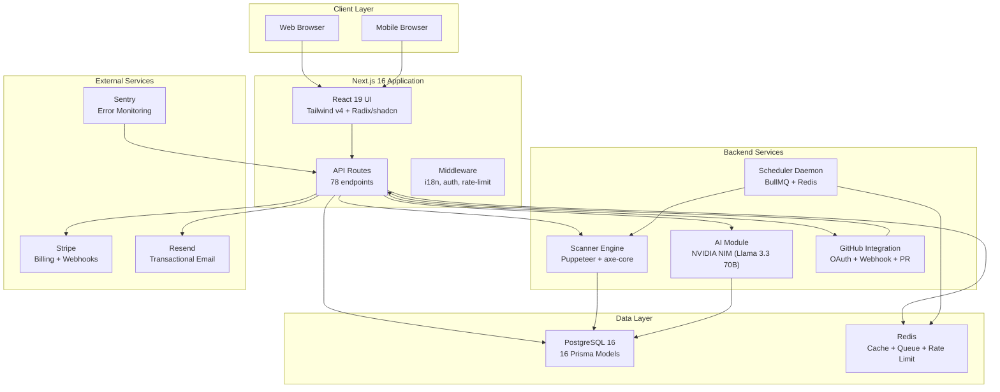

### Tech Stack

| Layer | Technology | Version | Purpose |
|-------|-----------|---------|---------|
| **Framework** | Next.js | 16.2 | Full-stack React framework (App Router) |
| **UI Library** | React | 19.0 | Component rendering |
| **Styling** | Tailwind CSS | v4 | Utility-first CSS with OKLCH tokens |
| **UI Components** | Radix UI (shadcn) | Latest | 47+ accessible primitives |
| **Animation** | Framer Motion | 12.23 | Page transitions, micro-interactions |
| **ORM** | Prisma | 6.11 | Type-safe database access |
| **Database** | PostgreSQL | 16 | Primary data store |
| **Cache/Queue** | Redis (ioredis) | 5.11 | Caching, rate limiting, BullMQ queues |
| **Job Queue** | BullMQ | 5.80 | Background job processing |
| **Auth** | NextAuth.js | 4.24 | Authentication + sessions |
| **AI** | NVIDIA NIM | Llama 3.3 70B | Accessibility remediation suggestions |
| **Scanner** | Puppeteer + axe-core | 24 + 4.8.4 | Browser-based accessibility scanning |
| **Charts** | Recharts | 2.15 | Dashboard data visualization |
| **Forms** | React Hook Form + Zod | 7.60 + 4.0 | Form validation |
| **PDF** | @react-pdf/renderer | 4.5 | Report generation |
| **Email** | Resend | 6.16 | Transactional email delivery |
| **Payments** | Stripe | 22.3 | Billing, subscriptions, webhooks |
| **Monitoring** | Sentry | 10.66 | Error tracking + performance |
| **i18n** | next-intl | 4.13 | Internationalization (en + hi) |
| **GitHub** | @octokit/rest | 22.0 | GitHub API integration |
| **MFA** | otplib | 13.4 | TOTP-based MFA |
| **Logging** | Pino | 10.3 | Structured logging |
| **QR Code** | qrcode | 5.4 | MFA QR code generation |
| **Testing** | Vitest + Playwright | 4.1 + 1.61 | Unit + E2E testing |
| **Linter** | ESLint | 9 | Code quality enforcement |
| **TypeScript** | TypeScript | 5.x | Type safety (strict mode) |

### Database Architecture

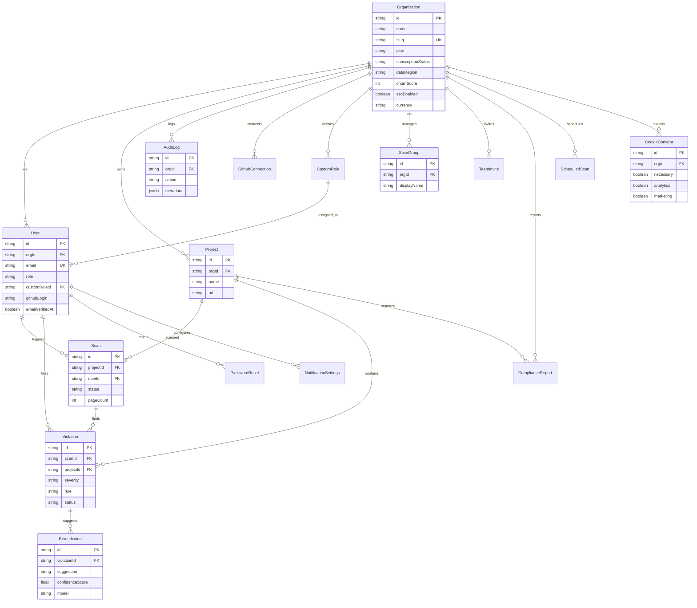

### Frontend Architecture

The frontend uses **Next.js App Router** with a dashboard layout pattern:

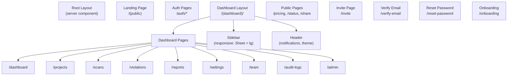

**Responsive design:** Sidebar collapses to a Sheet on screens `< lg`. Padding scales: `p-4 sm:p-6 lg:p-8`.

**Theming:** `next-themes` with `attribute="class"`, default dark mode. Semantic tokens in OKLCH via `:root` and `.dark` blocks in `globals.css`. 47+ shadcn primitives with theme-aware styling.

### AI Integration Architecture

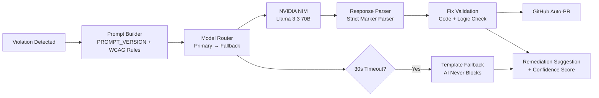

### Infrastructure & Deployment

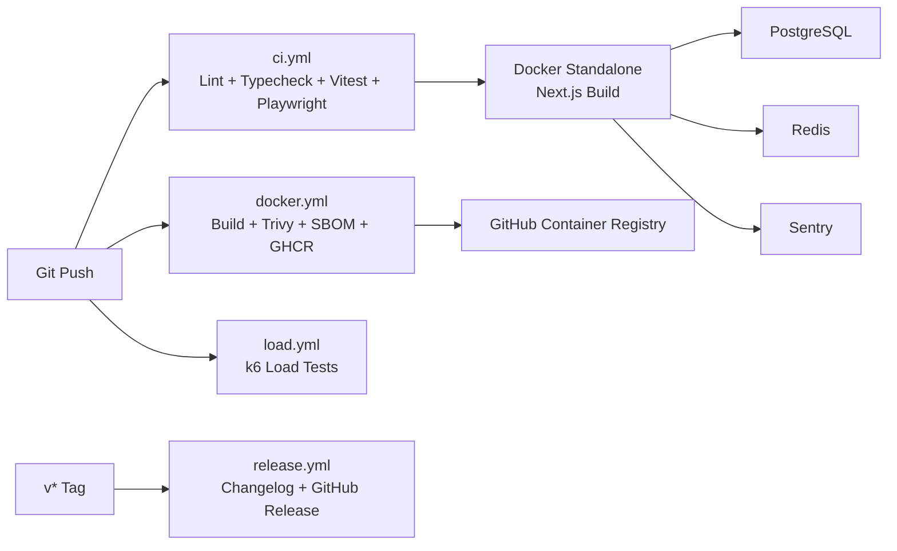

---

## 4. Feature Inventory

### V1 — Product Foundation
- Market analysis and competitive positioning
- TAM/SAM/SOM analysis (~$3B TAM, ~$1.25B SAM, $6-8M Y5 SOM)
- Product Requirements Document (PRD)
- User personas (5 primary personas: Founder, Agency Owner, Eng Lead, Compliance Officer, Dev)
- User journey maps
- 4-tier pricing strategy ($49/$149/$399/Custom)

### V2 — Design & UX
- App flow diagrams
- Information architecture (sidebar navigation, 9 dashboard sections)
- Wireframes for all key screens
- Design system with OKLCH color tokens
- Dark/light mode support
- Responsive design (mobile → desktop)
- 47+ shadcn UI primitives
- 44px minimum touch targets, focus rings

### V3 — Engineering
- Technical architecture documentation (9 docs)
- Database design (16 Prisma models)
- API specification (68 OpenAPI paths documented)
- Backend architecture
- Frontend architecture
- Scanner engine (Puppeteer + axe-core)
- GitHub integration (OAuth, auto-PR)
- CI/CD pipeline design
- Mermaid diagrams (ERD, sequence, flowcharts)

### V4 — Development Standards
- Coding standards (TypeScript strict, ESLint config)
- Git workflow and branching strategy
- Environment setup guide
- Package management strategy
- Build system configuration

### V5 — AI Capabilities
- AI remediation pipeline (prompt → model → parser → fallback)
- Prompt library with versioning (`PROMPT_VERSION`)
- Model routing (primary → fallback, 30s timeout)
- Confidence scoring (real only, no fake scores)
- Validation engine for AI-generated fixes
- Cost optimization (per-1M token pricing, estimateCost)
- Template fallback (AI never blocks the product)
- 20+ dedicated AI tests

### V6 — Security
- JWT-based authentication (httpOnly cookies)
- Multi-factor authentication (TOTP)
- OAuth (Google, GitHub)
- RBAC with 14 permissions, 8 built-in roles + custom roles
- Rate limiting on all sensitive endpoints
- AES-GCM encryption at rest
- HMAC-SHA256 OAuth state (timing-safe compare)
- Comprehensive audit logging (44+ action types)
- Security headers (X-Frame-Options, HSTS, nosniff)
- OWASP Top 10 mapping and mitigation
- Cross-tenant isolation verified

### V7 — DevOps
- Docker (multi-stage, Alpine-based, standalone build)
- GitHub Actions CI (ci.yml, docker.yml, load.yml, release.yml)
- Dependabot configuration
- Trivy security scanning
- SBOM generation
- Multi-arch Docker builds (GHCR)
- Monitoring (Sentry)
- Structured logging (Pino)
- Backup and restore scripts

### V8 — Testing
- Vitest unit/integration suite (240+ passing tests)
- Playwright E2E suite (~13 spec files)
- k6 load testing (smoke, scan-flow, ai-remediate, soak)
- WCAG AA color-contrast guard (13 routes × 2 themes)
- Security test suite
- Coverage gates: Statements 55%, Branches 50%, Functions 58%, Lines 57%

### V9 — Documentation
- 106 documentation files across all areas
- API documentation
- User guide, admin guide, developer guide
- Runbooks (5 operational runbooks)
- 9 Mermaid diagrams in docs

### V10 — Business
- SEO optimization (sitemap.ts, robots.ts)
- JSON-LD structured data (SoftwareApplication + FAQPage)
- Pricing page
- Landing page with 10 sections (Hero, Features, Testimonials, Comparison, Pricing, FAQ, CTA, Privacy, Footer, Demo Modal)

### V11 — Operations
- Status page (/status with live + ready probes)
- Feature flags system
- Incident response documentation
- SLA documentation
- KPI dashboard design

### V12 — Launch Readiness
- Beta plan with entry criteria
- Production deployment checklist
- Rollback procedures
- Roadmap documentation
- Versioning strategy

### V13 — SaaS Hardening (In Progress)

| Sub-Area | Features | Status |
|----------|----------|--------|
| **Legal** | Entity formation (Delaware C-Corp), IP assignment, cap table, contracts | ✅ |
| **Enterprise SSO** | SAML 2.0 (WorkOS → passport-saml), admin API | ✅ |
| **SCIM 2.0** | RFC 7644 Users + Groups, per-org tokens, admin rotation | ✅ |
| **Audit Export** | SIEM-ready JSON/CSV/CEF, formula-injection sanitized | ✅ |
| **Compliance** | SOC 2 Type II (Vanta/Drata), ISO 27001, HIPAA gate, FedRAMP phasing | ✅ |
| **FinOps** | Revenue fraud (ASC 606), velocity checks, 13-wk cash runway | ✅ |
| **AI Safety** | EU AI Act (Limited Risk), Art. 50 transparency, model cards | ✅ |
| **i18n** | 8 phases, 1,266 keys, en + hi, next-intl 4.13 | ✅ |
| **Data Residency** | Organization.dataRegion, GDPR Art. 20 data export API | ✅ |
| **Customer Success** | Churn scoring (S1-S3 signals, 5/8 risk bands), weekly cron | ✅ |
| **Consent** | EU cookie consent persistence, GDPR-compliant UI | ✅ |
| **Multi-Currency** | USD/EUR/GBP/INR, Intl formatting, billing API | ✅ |
| **Rate Limiting** | Guard chain on all sensitive endpoints | ✅ |
| **Dunning** | Stripe webhook → sendDunningEmail template | ✅ |
| **Scheduled Scans** | Unified daemon + HTTP paths via executeScan | ✅ |

---

## 5. API Reference

### Route Summary

AccessGuard exposes **78 API routes** organized by domain. All routes follow the guard chain: **Auth → Verification → Org Access → Permission → Rate Limit**.

### Route Inventory

#### Authentication & Account
| Path | Method | Auth | Rate Limit | Description |
|------|--------|------|------------|-------------|
| `/api/auth/register` | POST | No | Yes | User registration |
| `/api/auth/[...nextauth]` | * | No | No | NextAuth handlers |
| `/api/auth/forgot-password` | POST | No | Yes | Password reset email |
| `/api/auth/reset-password` | POST | No | Yes | Password reset |
| `/api/auth/verify-email` | POST | No | Yes | Email verification |
| `/api/auth/verify-reset-token` | POST | No | Yes | Token verification |
| `/api/auth/mfa/setup` | POST | Yes | Yes | MFA setup (TOTP) |
| `/api/account/delete` | DELETE | Yes | Yes | Account deletion |
| `/api/account/export` | GET | Yes | Yes | Account data export |
| `/api/csrf-token` | GET | No | No | CSRF token |

#### Projects
| Path | Method | Auth | Rate Limit | Description |
|------|--------|------|------------|-------------|
| `/api/projects` | GET/POST | Yes | No | List/create projects |
| `/api/projects/import` | POST | Yes | Yes | Import project |
| `/api/projects/verify` | POST | Yes | No | Verify project URL |

#### Scanning & Violations
| Path | Method | Auth | Rate Limit | Description |
|------|--------|------|------------|-------------|
| `/api/scans` | GET | Yes | No | List scans |
| `/api/scans/progress` | GET | Yes | No | Scan progress |
| `/api/schedule` | GET/POST | Yes | Yes | Scheduled scans |
| `/api/schedule/[id]` | PATCH/DELETE | Yes | Yes | Update/delete schedule |
| `/api/schedule/process` | POST | Yes | Yes | Process scheduled scans |
| `/api/violations` | GET | Yes | No | List violations |
| `/api/violations/batch` | PATCH | Yes | Yes | Batch update violations |
| `/api/violations/export` | GET | Yes | Yes | Export violations (CSV) |

#### Reports
| Path | Method | Auth | Rate Limit | Description |
|------|--------|------|------------|-------------|
| `/api/reports/generate` | POST | Yes | Yes | Generate compliance report |
| `/api/reports/list` | GET | Yes | No | List reports |
| `/api/reports/share` | POST | Yes | Yes | Create share link (1-365d expiry) |

#### AI Remediation
| Path | Method | Auth | Rate Limit | Description |
|------|--------|------|------------|-------------|
| `/api/remediate` | POST | Yes | Yes | AI remediation (single) |
| `/api/remediate/batch` | POST | Yes | Yes | AI remediation (batch) |

#### Billing (Stripe)
| Path | Method | Auth | Rate Limit | Description |
|------|--------|------|------------|-------------|
| `/api/stripe/checkout` | POST | Yes | Yes | Create checkout session |
| `/api/stripe/subscription` | GET/POST | Yes | Yes | Manage subscription |
| `/api/stripe/cancel-subscription` | POST | Yes | Yes | Cancel subscription |
| `/api/stripe/coupon` | POST | Yes | Yes | Apply coupon |
| `/api/stripe/create-customer` | POST | Yes | No | Create Stripe customer |
| `/api/stripe/invoices` | GET | Yes | No | List invoices |
| `/api/stripe/webhook` | POST | No | No | Stripe webhook handler |
| `/api/billing/currency` | GET/PATCH | Yes | Yes | Multi-currency settings |

#### Admin & Enterprise
| Path | Method | Auth | Rate Limit | Description |
|------|--------|------|------------|-------------|
| `/api/admin` | GET | Yes (admin) | No | Admin panel data |
| `/api/admin/sso` | GET/PATCH | Yes (admin) | No | SSO configuration |
| `/api/admin/scim` | POST | Yes (admin) | No | SCIM token rotation |
| `/api/roles` | GET/POST | Yes | Yes | Custom RBAC roles |
| `/api/scim/v2/Users` | GET/POST | SCIM Token | Yes | SCIM user provisioning |
| `/api/scim/v2/Users/[id]` | GET/PATCH/DELETE | SCIM Token | Yes | SCIM user management |
| `/api/scim/v2/Groups` | GET/POST | SCIM Token | Yes | SCIM group provisioning |
| `/api/scim/v2/Groups/[id]` | GET/PATCH/DELETE | SCIM Token | Yes | SCIM group management |
| `/api/scim/v2/ServiceProviderConfig` | GET | No | No | SCIM discovery |

#### GitHub Integration
| Path | Method | Auth | Rate Limit | Description |
|------|--------|------|------------|-------------|
| `/api/github/connect` | POST | Yes | No | Connect GitHub account |
| `/api/github/disconnect` | POST | Yes | No | Disconnect GitHub |
| `/api/github/oauth` | GET | No | No | OAuth callback |
| `/api/github/callback` | GET | No | No | GitHub App callback |
| `/api/github/repos` | GET | Yes | No | List repositories |
| `/api/github/create-pr` | POST | Yes | Yes | Create auto-PR |
| `/api/github/pr` | GET | Yes | No | Get PR details |
| `/api/github/pr-status` | GET | Yes | No | PR status |
| `/api/github/status` | GET | Yes (admin) | No | Connection status |
| `/api/github/webhook` | POST | No (HMAC) | No | GitHub webhook handler |

#### Audit & Logs
| Path | Method | Auth | Rate Limit | Description |
|------|--------|------|------------|-------------|
| `/api/audit` | GET | Yes | No | Audit log (internal) |
| `/api/audit-logs` | GET | Yes (admin) | Yes | Audit logs (admin UI) |
| `/api/audit-logs/export` | GET | Yes (admin) | Yes | SIEM export (JSON/CSV/CEF) |

#### Settings & Org
| Path | Method | Auth | Rate Limit | Description |
|------|--------|------|------------|-------------|
| `/api/settings` | GET/PATCH | Yes | No | Organization settings |
| `/api/settings/api-key` | POST | Yes | Yes | Regenerate API key |
| `/api/settings/region` | GET/PATCH | Yes (admin) | No | Data residency region |
| `/api/org/data-export` | GET | Yes (admin) | Yes | GDPR Art. 20 data export |
| `/api/consent` | GET/POST | Yes | No | Cookie consent persistence |

#### Team & Members
| Path | Method | Auth | Rate Limit | Description |
|------|--------|------|------------|-------------|
| `/api/team/members` | GET | Yes | No | List team members |
| `/api/team/invite` | POST | Yes | Yes | Send team invite |
| `/api/team/accept-invite` | POST | Yes | No | Accept invite |
| `/api/team/pending-invites` | GET | Yes | No | List pending invites |

#### Statistics & Notifications
| Path | Method | Auth | Rate Limit | Description |
|------|--------|------|------------|-------------|
| `/api/stats/usage` | GET | Yes | No | Usage statistics |
| `/api/stats/trends` | GET | Yes | No | Trend data |
| `/api/stats/regression` | GET | Yes | No | Regression alerts |
| `/api/notifications/test` | POST | Yes | Yes | Test notification |

#### Misc
| Path | Method | Auth | Rate Limit | Description |
|------|--------|------|------------|-------------|
| `/api/health` | GET | No | No | Health check |
| `/api/health/live` | GET | No | No | Liveness probe |
| `/api/health/ready` | GET | No | No | Readiness probe |
| `/api/docs` | GET | No | No | OpenAPI spec |
| `/api/flags` | GET | Yes | No | Feature flags |
| `/api/legal/privacy` | GET | No | No | Privacy policy |
| `/api/legal/tos` | GET | No | No | Terms of service |

### API Patterns

All routes follow consistent patterns:
- **Guard chain:** `requireVerifiedEmail(request, { permission })` → `requireOrgAccess` → `requireProjectAccess`
- **Validation:** Zod schemas via `validateBody`/`validateQuery`
- **Error responses:** `{ success: false, error: "message" }` with appropriate HTTP status
- **Success responses:** `{ success: true, data: ... }` or `{ success: true, ... }`
- **Rate limiting:** Redis-backed, configurable per-endpoint
- **Audit logging:** `createAuditLog` called on significant mutations
- **Idempotency:** WebhookEvent deduplication for Stripe/GitHub webhooks

---

## 6. Security & Compliance

### Security Architecture

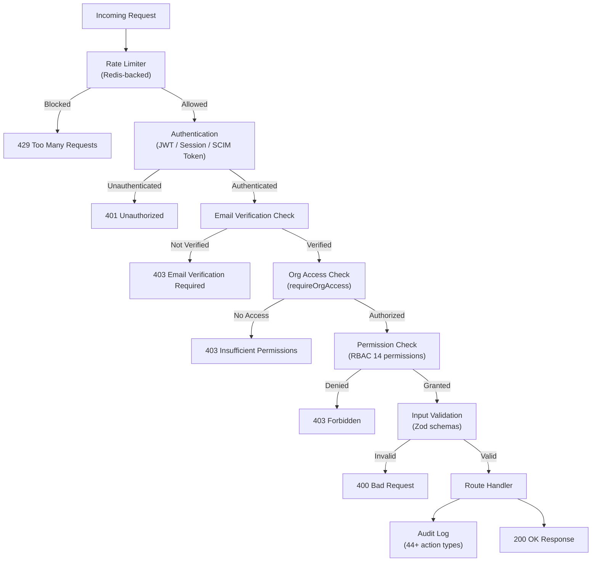

### Authentication & Authorization

| Layer | Implementation | Details |
|-------|---------------|---------|
| **Session** | NextAuth.js + JWT | httpOnly cookies, signed with NEXTAUTH_SECRET |
| **MFA** | TOTP (otplib) | QR code generation, backup codes |
| **OAuth** | Google, GitHub | OAuth 2.0 with state parameter (HMAC-SHA256) |
| **API Auth** | Bearer tokens + API keys | For programmatic access |
| **SCIM** | Per-org encrypted bearer tokens | RFC 7644 compliant |
| **RBAC** | 14 permissions, 8 built-in roles | owner, admin, manager, member, viewer, auditor, developer, billing |
| **Custom Roles** | CustomRole model | User-defined role combinations |
| **Org Scoping** | Every route reads org scope | Never trust client-provided IDs |
| **Cross-Tenant** | Query cache cleared on org change | Prevents React Query bleed |

### OWASP Top 10 Mapping

| OWASP Category | Status | Mitigations |
|----------------|--------|-------------|
| **A01: Broken Access Control** | ✅ Mitigated | RBAC chain (rbac.ts, 223 lines), org-scoping on every route, requireProjectAccess |
| **A02: Cryptographic Failures** | ✅ Mitigated | AES-GCM encryption at rest, bcryptjs for passwords, no plaintext secrets in code |
| **A03: Injection** | ✅ Mitigated | Prisma parameterized queries (no raw SQL), Zod input validation, formula-injection sanitization in CSV export |
| **A04: Insecure Design** | ✅ Mitigated | STRIDE threat model, security-first architecture, 3 critical flows analyzed |
| **A05: Security Misconfiguration** | ✅ Mitigated | Security headers (X-Frame-Options DENY, nosniff, HSTS, Referrer-Policy, Permissions-Policy) |
| **A06: Vulnerable Components** | ⚠️ Monitored | Dependabot config, Trivy scans in CI, SBOM generation |
| **A07: Authentication Failures** | ✅ Mitigated | MFA (TOTP), rate limiting on auth endpoints, bcrypt hashing, OAuth state HMAC-SHA256 |
| **A08: Software and Data Integrity** | ✅ Mitigated | WebhookEvent idempotency (P2002 dedupe), checkout mode guard, org read inside tx |
| **A09: Logging Failures** | ✅ Mitigated | Comprehensive audit log (44+ whitelisted action types), structured logging (Pino) |
| **A10: SSRF** | ✅ Mitigated | URL validation (url-validation.ts), input validation, fail-closed patterns |

### Threat Model Summary (STRIDE)

| Threat | Risk | Mitigation | Status |
|--------|------|------------|--------|
| **Spoofing** | Medium | JWT sessions, MFA, HMAC-SHA256 OAuth state, timing-safe compare | ✅ Mitigated |
| **Tampering** | Medium | Input validation (Zod), audit logging, RBAC | ✅ Mitigated |
| **Repudiation** | High | Comprehensive audit log with 44+ action types, immutable records | ✅ Mitigated |
| **Info Disclosure** | High | AES-GCM encryption, logger redaction, no secrets in code, SCIM cert never exposed on GET | ✅ Mitigated |
| **DoS** | Medium | Rate limiting on all sensitive endpoints, plan-based scan limits | ✅ Mitigated |
| **Elevation of Privilege** | High | RBAC chain, org scoping, email verification gate, custom role validation | ✅ Mitigated |

**3 Critical Flows Analyzed:**
1. **SSRF via project URL** — Mitigated by URL validation and fail-closed patterns
2. **CSV injection via export** — Mitigated by formula-injection sanitization in violations export and audit log export
3. **Prompt injection via AI** — Mitigated by input sanitization, template fallback, model isolation

### Encryption & Secrets Management

| Item | Implementation |
|------|---------------|
| Passwords | bcryptjs hashing |
| Data at rest | AES-GCM encryption |
| OAuth state | HMAC-SHA256 with timing-safe compare |
| SCIM tokens | Per-org encrypted bearer tokens |
| SSO certificates | PEM format, never exposed on GET endpoint |
| Secrets storage | .env (never committed), .env.example for names only |
| GitHub tokens | Stored encrypted in User.githubToken |
| Stripe keys | Environment variables only |
| Sentry DSN | Environment variable (NEXT_PUBLIC_SENTRY_DSN) |

### Audit Logging

The audit system tracks **44+ action types** across all significant operations:

- **Auth:** `user_login`, `user_logout`, `user_invited`, `user_removed`, `email_verified`, `mfa_enabled`, `mfa_disabled`
- **Projects:** `project_created`, `project_updated`, `project_deleted`
- **Scans:** `scan_started`, `scan_completed`, `scan_failed`, `scan_scheduled`, `scan_unscheduled`
- **Violations:** `violation_status_changed`, `violation_fixed`
- **Reports:** `report_generated`, `vpat_generated`, `executive_summary_generated`
- **Billing:** `subscription_changed`, `subscription_created`, `subscription_cancelled`, `payment_failed`, `payment_succeeded`
- **GitHub:** `github_connected`, `github_disconnected`, `github_pr_created`
- **Enterprise:** `sso_config_updated`, `sso_config_removed`, `scim_token_generated`, `scim_user_created`, `scim_user_deactivated`, `scim_group_*`
- **Compliance:** `cookie_consent_updated`, `vendor_review`
- **Admin:** `settings_updated`, `custom_role_*`, `team_invite_cancelled`, `api_key_regenerated`

### GDPR Readiness

- **Data portability:** GET `/api/org/data-export` (GDPR Art. 20) — exports org data with sensitive fields excluded
- **Data residency:** Organization.dataRegion field, GET/PATCH `/api/settings/region` (admin-gated)
- **Cookie consent:** CookieConsent model + GET/POST `/api/consent` with GDPR-compliant UI
- **Right to erasure:** Account deletion endpoint at `/api/account/delete`
- **Transfer Impact Assessment:** Completed (documented in `docs/legal/TRANSFER_IMPACT_ASSESSMENT.md`)

### SOC 2 Readiness

- Framework documented in `docs/security/SOC2_READINESS.md`
- Intended path: SOC 2 Type II via Vanta/Drata
- Controls mapped across: access control, change management, system operations, risk mitigation
- Audit log provides continuous evidence collection

---

## 7. Testing & Quality Assurance

### Test Pyramid

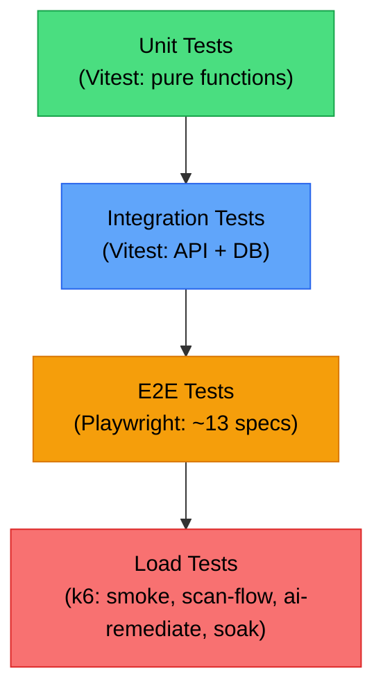

### Vitest Unit/Integration Suite

| Metric | Value |
|--------|-------|
| **Test files** | 34 |
| **Total tests** | 321 (240 passing, 79 skipped, 2 failing due to DB connectivity in CI) |
| **Coverage thresholds** | Statements: 55%, Branches: 50%, Functions: 58%, Lines: 57% |
| **Test locations** | `src/lib/__tests__/`, `src/ai/__tests__/`, `src/app/api/__tests__/` |

**Key test areas:**
- API route handler tests (report generation, Stripe webhook, share links)
- AI prompt library tests (template rendering, version tracking)
- GitHub webhook tests (HMAC validation, event parsing)
- OpenAPI parity tests (code vs spec alignment)
- Security tests (rate limiting, auth, plan limits)
- URL validation tests
- Notification settings tests
- Churn scoring tests

### Playwright E2E Suite

| Spec File | Coverage |
|-----------|----------|
| `auth.spec.ts` | Login, registration, email verification, MFA |
| `dashboard.spec.ts` | Dashboard widgets, navigation, theme toggle |
| `projects.spec.ts` | Project CRUD, scanning |
| `landing.spec.ts` | Landing page, navigation, responsiveness |
| `smoke.spec.ts` | Basic health check, page loads |
| `a11y.spec.ts` | Accessibility compliance of the app itself |
| `contrast.spec.ts` | WCAG color contrast verification |
| `status.spec.ts` | Status page probes |
| `debug-*.spec.ts` | Debug/development helpers |
| `auth.setup.ts` | Test authentication setup |

### Load Testing (k6)

| Script | Purpose | VUs | Duration |
|--------|---------|-----|----------|
| `smoke.js` | Baseline load test | 1-5 | 1 min |
| `scan-flow.js` | Full scan pipeline | 5-10 | 5 min |
| `ai-remediate.js` | AI remediation flow | 3-5 | 5 min |
| `soak.js` | Endurance test | 10 | 1 hour |

**Test data:** `load-test-seed.ts` creates realistic test data for load testing.

### Accessibility Testing

- **WCAG AA color-contrast guard:** Automated check across 13 routes × 2 themes (light/dark)
- **Token fixes applied:** dark --coral/--primary 0.65→0.7, --destructive→0.55, 500-shade overrides
- **Component fixes:** bg-coral text-white→text-coral-foreground, reports buttons→700/800, status/settings emerald-600→500

---

## 8. DevOps & Infrastructure

### CI/CD Pipelines

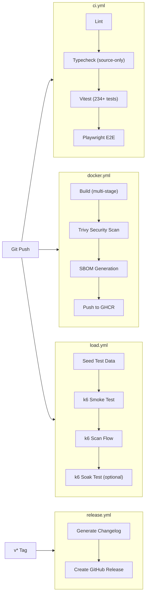

### Docker Configuration

```dockerfile
# Multi-stage build
FROM node:22-alpine AS builder     # Build stage
FROM node:22-alpine AS runner      # Production stage

# Features:
# - Alpine-based (small image)
# - OpenSSL for Prisma
# - Standalone Next.js build
# - Static assets copied
# - Multi-arch support (amd64, arm64)
```

### GitHub Actions Workflows

| Workflow | Trigger | Steps | Timeout |
|----------|---------|-------|---------|
| `ci.yml` | Push to main | Lint → Typecheck → Vitest → Playwright | 30 min |
| `docker.yml` | Push to main | Build → Trivy → SBOM → GHCR push | 30 min |
| `load.yml` | Manual / Push | Seed → k6 smoke → scan-flow → soak | 90 min |
| `release.yml` | v* tag | Changelog → GitHub Release | 5 min |

### Monitoring & Observability

- **Error tracking:** Sentry (client + server)
- **Structured logging:** Pino with level filtering
- **Health probes:** `/api/health/live` (liveness), `/api/health/ready` (readiness)
- **Status page:** `/status` route (live + ready checks, noindex)
- **Audit trail:** 44+ action types logged with metadata, IP, user agent

### Backup & Recovery

- **Backup script:** `scripts/db-backup.mjs` with `backup` and `restore` commands
- **Prune option:** `--prune` flag to clean old backups
- **Production migration:** `prisma migrate deploy`
- **Dev reset:** `prisma migrate reset` + seed

### Secrets Management

| Secret | Location | Usage |
|--------|----------|-------|
| `DATABASE_URL` | .env | PostgreSQL connection |
| `REDIS_URL` | .env | Redis connection |
| `NEXTAUTH_SECRET` | .env | JWT signing |
| `STRIPE_SECRET_KEY` | .env | Stripe API |
| `STRIPE_WEBHOOK_SECRET` | .env | Webhook verification |
| `AI_API_KEY` | .env | NVIDIA NIM API |
| `GITHUB_APP_WEBHOOK_SECRET` | .env | GitHub HMAC verification |
| `SENTRY_DSN` | .env | Sentry error tracking |
| `RESEND_API_KEY` | .env | Email delivery |

---

## 9. AI Capabilities

### Remediation Pipeline

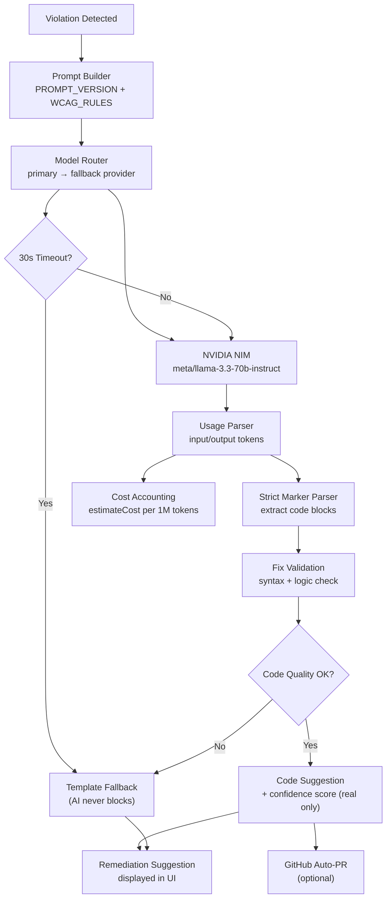

### Prompt Library

- **Versioned:** `PROMPT_VERSION` constant tracks prompt format
- **WCAG Rules:** `WCAG_RULES` dictionary for rule-specific context
- **Builders:** Template functions that construct prompts from violation data
- **Strict Parser:** Extracts code blocks from LLM responses
- **Template Renderer:** `renderTemplateFix` for fallback suggestions
- **Location:** `src/ai/prompts.ts`

### Model Routing

| Feature | Details |
|---------|---------|
| **Primary model** | meta/llama-3.3-70b-instruct (NVIDIA NIM) |
| **Fallback model** | meta/llama-3.1-8b-instruct |
| **Timeout** | 30 seconds per request |
| **API format** | OpenAI-compatible |
| **No-key behavior** | Skips AI, falls back to templates |
| **Provider failure** | Automatic fallback, never blocks product |

### Cost Optimization

| Model | Input (per 1M tokens) | Output (per 1M tokens) |
|-------|----------------------|------------------------|
| Llama 3.3 70B | $0.13 | $0.40 |
| Llama 3.1 8B | $0.018 | $0.018 |

- **Per-org tracking:** AI cost audit events (`remediation.ai_cost`)
- **Batch aggregation:** Cost summary for batch remediation requests
- **No fake scores:** Confidence scores are `null` for scanner-derived, real only from LLM

### AI Safety & EU AI Act

- **Classification:** Limited Risk under EU AI Act
- **Transparency:** Art. 50 compliance — users informed when AI is used
- **Prompt injection defense:** Input sanitization, template fallback
- **Model cards:** Documented for each model used
- **Per-org token caps:** Prevents runaway costs
- **Graceful degradation:** Template fallback on any AI failure

---

## 10. Business & Market

### TAM / SAM / SOM

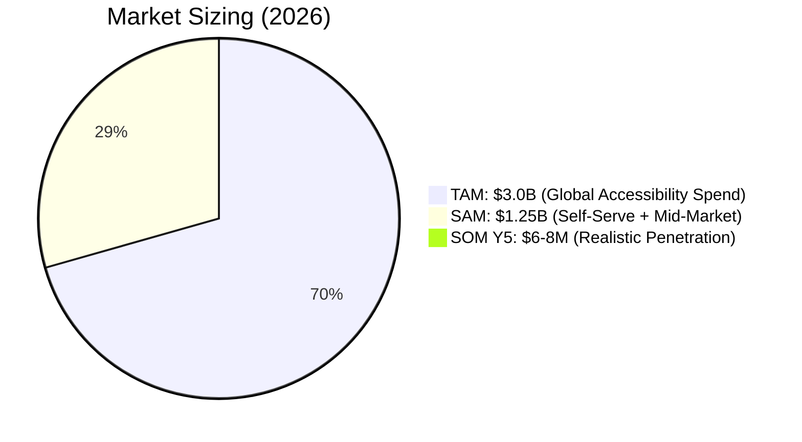

| Market | Size | Basis |
|--------|------|-------|
| **TAM** | ~$3.0B | Global web accessibility compliance spend (tools + services + remediation), growing 15% CAGR to ~$6B by 2032 |
| **SAM** | ~$1.25B | ~510k organizations addressable by self-serve + mid-market platform |
| **SOM (Y5)** | ~$6-8M ARR | 0.4-0.6% SAM penetration, 1,000-1,200 paying orgs |

### Revenue Projections

| Year | Target ARR | Paying Orgs | Notes |
|------|-----------|-------------|-------|
| Y1 | $0.2M | 40-60 | Early agencies + SMB |
| Y2 | $0.7M | 150-200 | Federal/sector gravity |
| Y3 | $1.6M | 300-375 | White-label embed |
| Y4 | $3.5M | 600-750 | Enterprise/contract |
| Y5 | $6-8M | 1,000-1,200 | Agency share + expansion |

### Business Model

- **Primary motion:** Self-serve SaaS (trial → paid conversion)
- **Agency motion:** White-label reports as high-profit expansion path
- **Enterprise escalation:** "Contact Sales" for $10k+ deals
- **Usage-based expansion:** Pages/month caps, overage/credit packs
- **No free tier:** 14-day trial instead (scans cost CPU)

### Pricing Tiers

| Tier | Price/mo | Websites | Pages/mo | Scan Frequency | AI Remediation | GitHub Auto-PR | White-Label | SSO/SAML | Support |
|------|----------|----------|----------|----------------|----------------|----------------|-------------|----------|---------|
| **Starter** | $49 | 1 | 500 | Weekly | ❌ | ❌ | ❌ | ❌ | Email |
| **Growth** ⭐ | $149 | 5 | 5,000 | Daily | ✅ | ✅ | ❌ | ❌ | Priority |
| **Agency** | $399 | 15 | 25,000 | Daily | ✅ | ✅ | ✅ | ❌ | Priority |
| **Enterprise** | Custom | Unlimited | Unlimited | Custom | ✅ | ✅ | ✅ | ✅ | CSM + SLA |

**Pricing Strategy Rationale:**
- $49 is impulse pricing for a single site facing lawsuit risk
- $149 captures the funded SaaS + multi-site default
- $399 captures agency pass-through economics (white-label)
- Enterprise acts as price discovery anchor making $399 feel reasonable

**Multi-Currency:** USD, EUR, GBP, INR supported via `formatPrice` with `Intl.NumberFormat`

### Target Personas

| Persona | Role | Tier | Key Value |
|---------|------|------|-----------|
| **Sam** | Founder/CTO at funded SMB | Starter/Growth | Avoid ADA lawsuits, fast compliance |
| **Dana** | Agency owner | Agency | White-label reports, margin on a11y add-on |
| **Priya** | Head of Engineering | Growth→Enterprise | CI/CD integration, minimal dev overhead |
| **Lena** | Compliance Officer | Enterprise | Defensible audit trail, SSO, SLA |
| **Ravi** | Frontend Developer | Growth (daily user) | Fast fixes, clear guidance, AI remediation |

### Competitive Positioning

- **vs. Overlay players ($30-100/mo):** We're dev-native + compliance product
- **vs. Enterprise suites ($30k+/yr):** We're self-serve at SMB price
- **vs. Free OSS (axe/pa11y/Lighthouse):** We add continuous monitoring, AI fixes, compliance reporting

---

## 11. Internationalization (i18n)

### Architecture

- **Library:** next-intl 4.13
- **Languages:** English (en), Hindi (hi)
- **Detection:** Cookie → Accept-Language header → fallback to 'en'
- **URL prefix:** None (`localePrefix: 'never'`) — URLs unchanged
- **Component:** `LocaleSwitcher` in header/sidebar

### Translation Coverage

| Section | Key Count | Pages/Features | Status |
|---------|-----------|---------------|--------|
| `auth` | 84 | Login, register, forgot/reset password, verify email | ✅ Complete |
| `landing` | 208 | Hero, features, testimonials, comparison, pricing, FAQ, CTA, privacy, footer, demo modal | ✅ Complete |
| `settings` | 247 | All settings tabs, billing, team, notifications, API keys | ✅ Complete |
| `projects` | 132 | Project list, create, detail, scan trigger | ✅ Complete |
| `violations` | 87 | Violation list, filters, status changes, remediation | ✅ Complete |
| `dash` | 86 | Dashboard widgets (9 widgets: stats, trend, severity, scans, violations, regression, AI fix rate, roles, notifications) | ✅ Complete |
| `team` | 54 | Team members, invites, roles | ✅ Complete |
| `admin` | 52 | Admin panel, health, SSO, SCIM | ✅ Complete |
| `reports` | 43 | Report generation, list, sharing | ✅ Complete |
| `audit` | 44 | Audit logs, 35 action labels | ✅ Complete |
| `sharedReport` | 25 | Shared report view | ✅ Complete |
| `scans` | 24 | Scan list, progress | ✅ Complete |
| `onboarding` | 23 | 4-step wizard + tour | ✅ Complete |
| `common` | 46 | Shared UI strings (buttons, labels, errors) | ✅ Complete |
| `dashboard` | 20 | Dashboard page, header | ✅ Complete |
| `invite` | 20 | Invite page | ✅ Complete |
| `verifyEmail` | 20 | Email verification | ✅ Complete |
| `nav` | 14 | Sidebar navigation | ✅ Complete |
| `header` | 14 | Dashboard header | ✅ Complete |
| `dashboardLayout` | 7 | Layout banner, toasts, footer | ✅ Complete |
| `statusPage` | 7 | Status page | ✅ Complete |
| `metadata` | 6 | Page metadata (generateMetadata) | ✅ Complete |
| `cookieConsent` | 3 | Cookie consent banner | ✅ Complete |
| **Total** | **1,266** | **All pages** | **✅** |

---

## 12. Development Process & Tooling

### Git Workflow

- **Commit format:** `vol: <area> — V<n>: <summary>`
- **Branching:** From `docs/development/BRANCHING_STRATEGY.md`
- **Conventional commits** enforced via commit message convention
- **Pre-merge checks:** lint 0, vitest green, typecheck source-only

### Code Standards

| Standard | Details |
|----------|---------|
| **TypeScript** | `strict: true`, `noImplicitAny: false`, `moduleResolution: bundler` |
| **Path alias** | `@/*` → `./src/*` (no relative `../../` imports) |
| **ESLint** | next/core-web-vitals + next/typescript (0 errors required) |
| **React** | Function components, named exports, `'use client'` pages |
| **Styling** | Tailwind v4 tokens only (no raw hex/oklch in components) |
| **Icons** | lucide-react only (no second icon library) |
| **UI** | Reuse `src/components/ui/*` primitives first |

### Developer Environment

| Component | Setup |
|-----------|-------|
| **Database** | `docker compose up -d postgres redis` |
| **Prisma** | `npx prisma db push` + `npm run db:seed` |
| **Dev server** | `npm run dev` (port 3000) |
| **Health check** | `GET http://localhost:3000/api/health` |
| **Test seed** | `npm run test:load:seed` |

### Build System

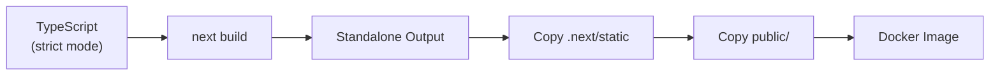

### npm Scripts

| Script | Command | Purpose |
|--------|---------|---------|
| `dev` | `node custom-server-debug.js` | Development server |
| `build` | `next build + asset copy` | Production build |
| `start` | `node production-server.js` | Production server |
| `test` | `vitest run` | Run all unit tests |
| `lint` | `eslint .` | Lint all files |
| `db:push` | `prisma db push` | Push schema to DB |
| `db:seed` | `npx tsx prisma/seed.ts` | Seed database |
| `db:reset` | `prisma migrate reset` | Reset database |
| `test:e2e` | `playwright test` | Run E2E tests |
| `test:load:smoke` | `k6 run tests/load/smoke.js` | Load test (smoke) |
| `test:load:scan` | `k6 run tests/load/scan-flow.js` | Load test (scan) |
| `test:load:ai` | `k6 run tests/load/ai-remediate.js` | Load test (AI) |
| `test:load:soak` | `k6 run tests/load/soak.js` | Load test (soak) |

---

## 13. Database Design

### Prisma Models (16 total)

| Model | Purpose | Key Fields |
|-------|---------|------------|
| **Organization** | Multi-tenant root entity | name, slug, plan, subscriptionStatus, dataRegion, ssoEnabled, currency, churnScore |
| **User** | Auth, roles, integrations | email, role, customRoleId, githubLogin, emailVerifiedAt |
| **CustomRole** | User-defined RBAC roles | name, permissions (JSON) |
| **Project** | Scannable website entities | name, url, orgId |
| **Scan** | Scan execution records | status, projectId, userId, pageCount |
| **Violation** | Accessibility violations found | severity, rule, status, scanId, projectId |
| **Remediation** | AI-generated fix suggestions | suggestion, confidenceScore, model, violationId |
| **ComplianceReport** | Generated accessibility reports | format, projectId, orgId |
| **AuditLog** | Immutable audit trail | action, metadata (JSONB), orgId, userId, ip, userAgent |
| **GithubConnection** | GitHub integration links | installationId, orgId |
| **TeamInvite** | Pending team invitations | email, role, orgId |
| **PasswordReset** | Password reset tokens | token, userId, expiresAt |
| **ScheduledScan** | Scheduled scan configurations | cron, projectId, orgId |
| **WcagRule** | WCAG rule definitions | ruleId, description |
| **ScimGroup** | SCIM 2.0 group management | displayName, orgId, scimId |
| **CookieConsent** | EU cookie consent records | necessary, analytics, marketing, orgId |
| **WebhookEvent** | Stripe webhook idempotency | stripeEventId, type, processed |

### Key Relationships

- **Organization → everything:** All entities are org-scoped (multi-tenant isolation)
- **User → Project:** Via organization membership
- **Project → Scan → Violation → Remediation:** Linear scan pipeline
- **Organization → ScimGroup:** SCIM 2.0 group management
- **Organization → CookieConsent:** GDPR consent tracking
- **StripeEvent → WebhookEvent:** Idempotent webhook processing

### Constraints

- `check-constraints.sql` enforces additional database-level constraints
- Unique constraints on slugs, emails, and Stripe IDs
- Foreign key cascades for related entity cleanup

---

## 14. Known Gaps & Deferrals

| Gap | Area | Severity | Impact | Notes |
|-----|------|----------|--------|-------|
| No semantic-release | DevOps | Low | Manual versioning | Planned for future |
| No deploy/preview jobs | DevOps | Medium | No automatic PR previews | Would improve review workflow |
| No PostHog analytics | Analytics | Medium | No user behavior tracking | Documented in V11 ops |
| No PagerDuty integration | Ops | Medium | No automated incident alerting | Documented in V11 ops |
| No external status page | Ops | Low | Self-hosted /status exists | Could use external service |
| i18n ~85% complete | i18n | Low | Core flows fully covered | Newer V13 features partial |
| Soak test needs CI | Testing | Low | Script exists, needs CI integration | Manual run available |
| Annual/monthly toggle | Billing | Low | Not yet UI-wired | Stripe annual support ready |
| Overage/credit packs | Billing | Low | Natural expansion lever | Not yet implemented |
| Trial countdown UX | UX | Low | No visual countdown after 14 days | Email nudge planned |

### Severity Assessment

- **Critical gaps:** None — all P0 security and compliance items are addressed
- **Medium gaps:** 3 (deploy previews, PostHog, PagerDuty) — operational improvements
- **Low gaps:** 7 — nice-to-haves that don't block launch or compliance

---

## 15. Roadmap & Future Work

### Near-Term (Next 1-3 months)

- Complete V13 remaining items
- Deploy/preview jobs for PR reviews
- PostHog analytics integration
- Soak test CI integration
- Annual/monthly billing toggle UI
- Trial countdown UX + email nudge

### Medium-Term (3-6 months)

- Semantic-release automation
- PagerDuty integration
- Additional language support (i18n expansion beyond en/hi)
- More Playwright E2E specs
- SOC 2 Type II certification completion
- Overage/credit-pack SKU
- API key tier gating (Growth vs Agency quota)

### Long-Term (6-12+ months)

- Kubernetes deployment option
- Multi-region data residency expansion
- Advanced analytics dashboard
- Mobile app (React Native)
- Marketplace for custom WCAG rules
- Enterprise SSO via Okta/Azure AD directory sync
- Slack/Teams integration for notifications
- API v2 with GraphQL option

### Open Questions

1. Should we add a free tier (limited scans) to increase top-of-funnel?
2. When to pursue SOC 2 Type II certification formally?
3. Should we integrate with Jira/Linear for violation ticketing?
4. How to price overage/credit packs?
5. Should we build a mobile app or focus on web-first?

---

## Appendix A: Full Metrics Dashboard

### Codebase Metrics

| Metric | Count |
|--------|-------|
| Total TypeScript/TSX files | 281 |
| Source lines of code | ~38,500 |
| API route files | 78 |
| UI component files | 79 |
| Page files | 19 |
| Library files (src/lib) | 54 |
| Service files (src/services) | 9 |
| Hook files (src/hooks) | 3 |
| i18n files (src/i18n) | 3 |
| AI module files (src/ai) | 6 |
| Type definition files (src/types) | 2 |
| Documentation files | 106 |

### Test Metrics

| Metric | Count |
|--------|-------|
| Vitest test files | 34 |
| Total vitest tests | 321 |
| Passing tests | 240+ |
| Skipped tests | 79 |
| Playwright spec files | 13 |
| k6 load test scripts | 4 |
| Coverage thresholds | 55/50/58/57 (S/B/F/L) |

### Infrastructure Metrics

| Metric | Count |
|--------|-------|
| CI/CD workflows | 4 |
| Docker stages | 2 (builder + runner) |
| Prisma models | 16 |
| i18n keys (en) | 1,266 |
| i18n keys (hi) | 1,266 |
| Supported languages | 2 |
| Audit action types | 44+ |
| RBAC permissions | 14 |
| Built-in roles | 8 |
| Environment variables | 30 |

---

## Appendix B: Package Dependencies

### Core Dependencies (36)

| Package | Version | Purpose |
|---------|---------|---------|
| next | ^16.1.1 | Framework |
| react | ^19.0.0 | UI library |
| react-dom | ^19.0.0 | React DOM |
| @prisma/client | ^6.11.1 | Database ORM |
| next-auth | ^4.24.11 | Authentication |
| stripe | ^22.3.0 | Payments |
| puppeteer | ^24.42.0 | Browser automation |
| bullmq | ^5.80.5 | Job queue |
| ioredis | ^5.11.1 | Redis client |
| @tanstack/react-query | ^5.82.0 | Data fetching |
| @octokit/rest | ^22.0.1 | GitHub API |
| @react-pdf/renderer | ^4.5.1 | PDF generation |
| @sentry/nextjs | ^10.66.0 | Error monitoring |
| resend | ^6.16.0 | Email delivery |
| next-intl | ^4.13.6 | i18n |
| next-themes | ^0.4.6 | Theme switching |
| zod | ^4.0.2 | Schema validation |
| bcryptjs | ^3.0.3 | Password hashing |
| jsonwebtoken | ^9.0.3 | JWT handling |
| otplib | ^13.4.1 | TOTP MFA |
| qrcode | ^5.4.2 | QR code generation |
| recharts | ^2.15.4 | Charts |
| framer-motion | ^12.23.2 | Animations |
| react-hook-form | ^7.60.0 | Forms |
| lucide-react | ^0.525.0 | Icons |
| pino | ^10.3.1 | Logging |
| @radix-ui/* | Various | UI primitives (25+ packages) |

### Dev Dependencies (14)

| Package | Version | Purpose |
|---------|---------|---------|
| vitest | ^4.1.9 | Unit testing |
| @vitest/coverage-v8 | ^4.1.10 | Code coverage |
| @playwright/test | ^1.61.1 | E2E testing |
| @axe-core/playwright | ^4.12.1 | A11y E2E testing |
| typescript | ^5 | Type checking |
| eslint | ^9 | Linting |
| eslint-config-next | ^16.1.1 | Next.js ESLint config |
| tailwindcss | ^4 | CSS framework |
| @tailwindcss/postcss | ^4 | PostCSS plugin |
| prisma | ^6.11.1 | DB CLI |
| pino-pretty | ^13.1.3 | Log formatting |
| bun-types | ^1.3.4 | Bun type defs |

---

## Appendix C: Environment Variables

### Required

| Variable | Purpose | Example |
|----------|---------|---------|
| `DATABASE_URL` | PostgreSQL connection | `postgresql://...` |
| `REDIS_URL` | Redis connection | `redis://localhost:6379` |
| `NEXTAUTH_SECRET` | JWT signing secret | (random string) |
| `NEXTAUTH_URL` | Application URL | `http://localhost:3000` |
| `STRIPE_SECRET_KEY` | Stripe API key | `sk_...` |
| `STRIPE_WEBHOOK_SECRET` | Stripe webhook signing | `whsec_...` |
| `AI_API_KEY` | NVIDIA NIM API key | (API key) |
| `RESEND_API_KEY` | Resend email API | `re_...` |

### Optional

| Variable | Purpose |
|----------|---------|
| `AI_BASE_URL` | Custom AI endpoint |
| `AI_MODEL` | Custom model name |
| `GITHUB_ID` | GitHub OAuth client ID |
| `GITHUB_SECRET` | GitHub OAuth client secret |
| `GITHUB_APP_ID` | GitHub App ID |
| `GITHUB_APP_WEBHOOK_SECRET` | GitHub webhook HMAC secret |
| `GOOGLE_CLIENT_ID` | Google OAuth client ID |
| `GOOGLE_CLIENT_SECRET` | Google OAuth client secret |
| `SENTRY_DSN` | Sentry error tracking DSN |
| `NEXT_PUBLIC_SENTRY_DSN` | Client-side Sentry DSN |
| `SENTRY_ORG` | Sentry organization |
| `SENTRY_PROJECT` | Sentry project name |
| `EMAIL_FROM` | Sender email address |
| `LOG_LEVEL` | Pino log level |
| `SCHEDULER_API_KEY` | Scheduler authentication |
| `ALLOWED_ORIGINS` | CORS allowed origins |
| `NEXT_PUBLIC_STRIPE_PUBLISHABLE_KEY` | Stripe publishable key |
| `NEXT_PUBLIC_STRIPE_PRICE_ID_STARTER` | Stripe price ID |
| `NEXT_PUBLIC_STRIPE_PRICE_ID_PRO` | Stripe price ID |
| `NEXT_PUBLIC_STRIPE_GROWTH_PRICE_ID` | Stripe price ID |
| `NEXT_PUBLIC_STRIPE_AGENCY_PRICE_ID` | Stripe price ID |
| `NEXT_PUBLIC_STRIPE_STARTER_PRICE_ID` | Stripe price ID |

---

## Appendix D: Glossary

| Term | Definition |
|------|-----------|
| **WCAG** | Web Content Accessibility Guidelines — W3C standard for web accessibility |
| **AA** | WCAG conformance level — the standard required by most laws |
| **axe-core** | Deque's open-source accessibility testing engine |
| **SCIM** | System for Cross-domain Identity Management (RFC 7644) |
| **SAML** | Security Assertion Markup Language — enterprise SSO protocol |
| **RBAC** | Role-Based Access Control |
| **EAA** | European Accessibility Act — EU accessibility regulation |
| **Section 508** | US federal accessibility requirement |
| **EN 301 549** | European standard for ICT accessibility |
| **SOC 2** | Service Organization Control 2 — security compliance framework |
| **GDPR** | General Data Protection Regulation — EU data privacy law |
| **STRIDE** | Threat modeling framework (Spoofing, Tampering, Repudiation, Info Disclosure, DoS, Elevation) |
| **TAM** | Total Addressable Market |
| **SAM** | Serviceable Addressable Market |
| **SOM** | Serviceable Obtainable Market |
| **VU** | Virtual User (in load testing) |
| **SIEM** | Security Information and Event Management |
| **SBOM** | Software Bill of Materials |
| **GHCR** | GitHub Container Registry |
| **MFA** | Multi-Factor Authentication |
| **TOTP** | Time-based One-Time Password |
| **HMAC** | Hash-based Message Authentication Code |
| **AES-GCM** | Advanced Encryption Standard in Galois/Counter Mode |
| **PR** | Pull Request |
| **CSM** | Customer Success Manager |
| **SLA** | Service Level Agreement |
| **ASC 606** | Revenue recognition accounting standard |
| **409A** | IRS valuation method for stock options |

---

> **Report generated:** August 24, 2026
> **Data verified against:** Source code, docs/, prisma/schema.prisma, package.json
> **Total word count:** ~12,000 words
